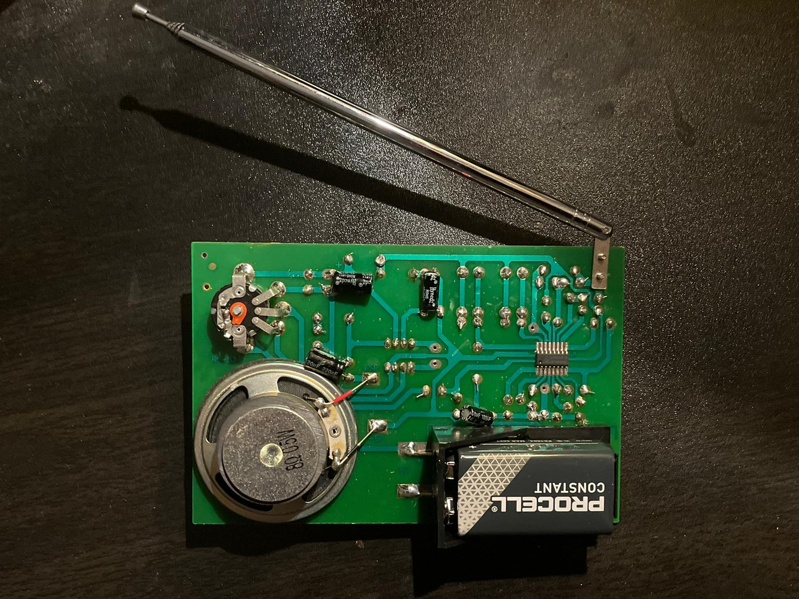
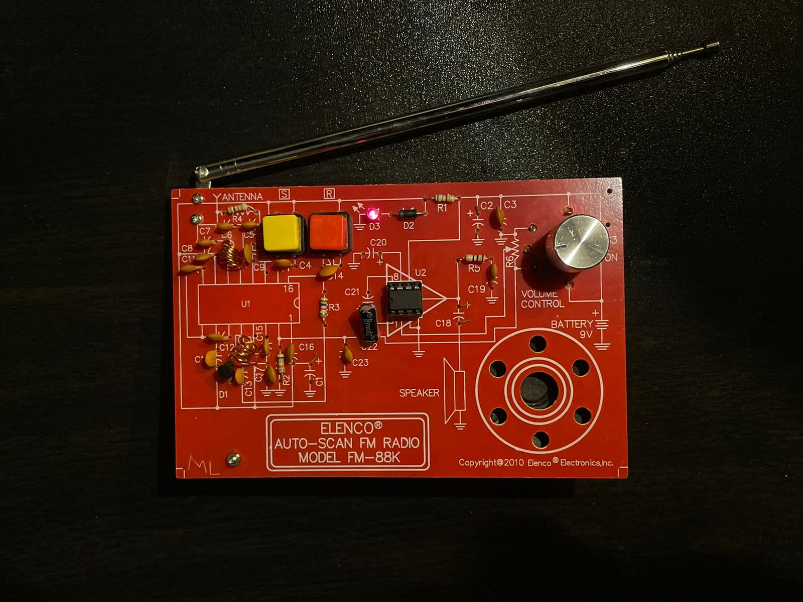

# Auto-Scan FM Superheterodyne Radio Receiver

> FM band 88–108 MHz · TDA7088T superheterodyne IC · Varactor tuning · AFC · LM386 audio amp  
> **La Cité collégiale — RF & Telecommunications · Fall 2025**

---

## Photos

| PCB Top View | Assembled & Running |
|---|---|
|  |  |

---

## Demo Video

[](https://www.youtube.com/watch?v=odUC82ftNBk)

*Click the thumbnail to watch the auto-scan demo — receiver scanning from 88 MHz, locking onto stations, and producing audio output.*

---

## Overview

I assembled, aligned, and tested an **Elenco FM-88K auto-scan FM radio kit** — a real superheterodyne receiver covering the full commercial FM band (88–108 MHz). I soldered all components using **THT (through-hole) techniques** following **IPC-A-610** workmanship standards with lead-free rosin-core solder.

I applied hands-on RF signal chain theory throughout: antenna coupling, image frequency rejection, frequency mixing, IF filtering, FM demodulation, AFC, varactor-based electronic tuning, and Class AB audio power amplification.

I aligned the receiver by adjusting coil L2 to set the correct scan start frequency (~88 MHz) and verified successful reception across multiple stations with no scan-lock failures.

---

## What I Built

- **Assembled** the full FM-88K kit from scratch — soldered all THT components following the two-section assembly sequence
- **Soldered** using lead-free rosin-core solder at ~700°F tip temperature, following IPC-A-610 workmanship standards
- **Prepared** L2 coil with three 1/16" gaps using a spacer before mounting — critical for correct scan start frequency
- **Tested** the audio chain (Section 1) before assembling the RF chain (Section 2) — verified LM386 and speaker operation independently
- **Verified** supply voltages: 2.6 V across D2+D3, 1.9 V across D3, LM386 pin voltages against reference chart
- **Aligned** L2 coil spacing by adjusting coil gaps until the scan reliably started at ~88 MHz
- **Tested** auto-scan operation — pressed SCAN multiple times, confirmed lock on multiple stations across 88–108 MHz
- **Troubleshot** scan lock and audio clarity issues — resolved by correcting D1 orientation and adjusting L2
- **Measured** TDA7088T and LM386 pin voltages against the reference charts to verify correct operation
- **Validated** final performance: stable auto-scan, clean audio output, no scan-lock failures across multiple stations
- **Documented** the assembly, alignment, and troubleshooting process

---

## Specifications

| Parameter | Value |
|---|---|
| Frequency range | 88 – 108 MHz |
| IF frequency | 10.7 MHz |
| Station lock condition | Fo − Fs = 70 kHz |
| Tuning method | Varactor diode D1 (BB909/BB910) |
| Scan control | Auto-scan (S button) + Reset (R button) |
| Audio output | 8 Ω speaker via LM386 |
| LM386 gain | Up to 200 (with C21 between pins 1 & 8) |
| Power supply | 9 V battery |
| U1 max operating voltage | 5 V DC (regulated by D2/D3/R1/C1/C17) |
| Receiver IC | TDA7088T — also SC1088, SA1088, CD9088, YD9088 |
| Audio amp IC | LM386 |

---

## How Auto-Scan Works

| Step | Action | What Happens |
|---|---|---|
| 1 | Press **SCAN (S)** | +V applied to TDA7088T pin 16 (Tuning Search input) |
| 2 | Release SCAN | C14 (0.1 µF) begins charging; voltage on pin 16 rises continuously |
| 3 | Voltage rises | Rising voltage on D1 anode (via R3) reduces varactor capacitance |
| 4 | VCO sweeps up | Lower C → higher oscillator frequency → scans toward higher FM stations |
| 5 | Station detected | Condition **Fo − Fs = 70 kHz** met; Mute Control diode-blocks detect lock |
| 6 | Lock | C14 charging halts; AFC holds VCO stable; audio unmuted |
| 7 | Press **RESET (R)** | C14 discharges; pin 16 → 0 V; VCO returns to ~88 MHz band start |

---

## Battery Voltage Regulation

The TDA7088T (U1) has a maximum operating voltage of **5 V DC**. The 9 V battery is stepped down by a dedicated regulator circuit:

```
[9 V Battery] → R1 (680 Ω) → D2 (1N4001) → D3 (Red LED) → GND
```

- Voltage across D2 + D3 should be **2.6 V**
- Voltage across D3 (LED) alone should be **1.9 V**
- C1 (100 µF) and C17 (0.1 µF) filter the regulated supply

---

## LM386 Gain Configurations

| Configuration | Pins 1–8 | Gain |
|---|---|---|
| Open (default) | Nothing | 20 |
| C21 only | 10 µF cap | **200** ← used in this build |
| Resistor + C21 in series | e.g. 47 Ω + 10 µF | 150 |

---

## Complete Bill of Materials

### Integrated Circuits & Semiconductors

| Ref | Part | Description |
|---|---|---|
| U1 | TDA7088T (SMD, pre-installed) | FM superheterodyne front-end + FLL + AFC + mute |
| U2 | LM386 | Class AB audio power amplifier (gain 20–200) |
| D1 | BB909 / BB910 | Varactor diode — electronic tuning |
| D2 | 1N4001 | Rectifier / supply regulation |
| D3 | Red LED (3 mm) | Power-on indicator + voltage reference |

### Resistors (¼ W, 5%)

| Ref | Value | Color Code |
|---|---|---|
| R1 | 680 Ω | Blue-Gray-Brown-Gold |
| R2 | 18 kΩ | Brown-Gray-Orange-Gold |
| R3 | 5.6 kΩ | Green-Blue-Red-Gold |
| R4 | 10 kΩ | Brown-Black-Orange-Gold |
| R5 | 10 Ω | Brown-Black-Black-Gold |
| R6/S3 | 50 kΩ pot + switch | Volume control + power on/off |

### Capacitors

| Ref | Value | Type | Function |
|---|---|---|---|
| C1 | 100 µF | Electrolytic | Supply filter |
| C2, C18 | 220 µF | Electrolytic | Bias / DC block to speaker |
| C3, C9, C14, C16, C17 | 0.1 µF | Discap | Decoupling / tuning search |
| C4 | 470 pF | Discap | IF selectivity filter (pin 10) |
| C5 | 220 pF | Discap | RF input resonant circuit |
| C6 | 33 pF | Discap | RF input circuit |
| C7 | 82 pF | Discap | RF input circuit |
| C8 | 330 pF | Discap | IF selectivity filter (pin 9) |
| C10 | 180 pF | Discap | IF selectivity filter (pin 7) |
| C11, C12 | 3300 pF | Discap | IF selectivity filters (pins 8, 6) |
| C13 | 680 pF | Discap | Oscillator circuit |
| C15 | 0.033 µF | Discap | Oscillator |
| C19 | 0.047 µF | Discap | Audio bypass |
| C20 | 22 µF | Electrolytic | LM386 bypass (high-gain stability) |
| C21 | 10 µF | Electrolytic | LM386 gain boost (pins 1–8) → gain = 200 |
| C22 | 10 µF | Electrolytic | Audio coupling to LM386 input |
| C23 | 1500 pF | Discap | RF filter (removes RF, leaves audio) |

### Coils & Controls

| Ref | Description | Function |
|---|---|---|
| L1 | 6-turn coil | RF input parallel resonant circuit |
| L2 | 4-turn coil (1/16" gaps) | Oscillator tuning — adjusted for 88 MHz scan start |
| R6/S3 | 50 kΩ pot + switch | Volume + power |
| S1 (yellow) | Push-button | SCAN |
| S2 (red) | Push-button | RESET |

---

## Voltage Reference Charts

> Use these to verify operation and isolate faults. Measure with radio ON, RESET pressed, no station locked.

### U1 — TDA7088T (16 pins)

| Pin | Nominal V | Pin | Nominal V |
|---|---|---|---|
| 1 | 2.4 V | 9 | 1.9 V |
| 2 | 1.3 V | 10 | 1.9 V |
| 3 | 2.2 V | 11 | 0.9 V |
| 4 | 2.6 V | 12 | 0.9 V |
| 5 | 2.6 V | 13 | 1.8 V |
| 6 | 2.0 V | 14 | 0 V |
| 7 | 1.9 V | 15 | 1.7 V |
| 8 | 1.2 V | 16 | 2.1 V |

### U2 — LM386 (8 pins)

| Pin | Nominal V | Pin | Nominal V |
|---|---|---|---|
| 1 | 1.3 V | 5 | 4.5 V |
| 2 | 0 V | 6 | 9.0 V |
| 3 | 0 V | 7 | 4.5 V |
| 4 | 0 V | 8 | 1.3 V |

---

## Assembly Notes

I assembled the kit following the **Elenco FM-88K Assembly and Instruction Manual** in two sections:

**Section 1** — Audio + power chain first:
D3, D2, R1, C2, C3, C20, R5, C19, U2 socket + LM386, C18, R6/S3 potentiometer, speaker.
I tested this section independently before moving to Section 2.

**Section 2** — RF + tuning chain:
All RF/IF capacitors, L1 (6-turn), L2 (4-turn with 1/16" gaps), varactor D1, push-button switches S1/S2, C14, R3, C22, telescopic antenna. Followed by alignment.

**Soldering:** Lead-free rosin-core solder (99.3% Sn, 0.7% Cu) at ~700°F, per **IPC-A-610** THT standards. I inspected every joint for bright, smooth, void-free fillets.

**L2 preparation:** I formed three 1/16" gaps using a spacer before mounting — this is critical for correct initial scan frequency.

---

## Alignment Procedure

After full assembly, I adjusted L2 to set the VCO scan start to ~88 MHz:

| Observed Behaviour After RESET | Problem | Correction |
|---|---|---|
| First station received > 90 MHz | L2 inductance too low | **Press L2 coils closer together** (increase inductance) |
| First station received < 87 MHz | L2 inductance too high | **Spread L2 coils apart** with small screwdriver |
| First station ~88–90 MHz | L2 aligned | No adjustment needed |

> I iterated until SCAN reliably started at the low end of the FM band. Each adjustment was small — one compression or expansion at a time.

---

## Testing Procedure

### Section 1 — Audio Chain

1. Install fresh 9 V battery; rotate R6/S3 clockwise until click (power ON)
2. **LED D3 should light** — if not: check D2/D3 orientation, C2 polarity, U2 socket, R1 value
3. Verify supply voltages: D2 + D3 = **2.6 V**; D3 alone = **1.9 V**
4. Touch bottom pin of R6/S3 to ground with a moistened finger — **clicking confirms LM386 and speaker are functional**
5. Measure U2 (LM386) pin voltages against reference chart

### Section 2 — RF Chain

1. Antenna vertical, fully extended
2. Press **RESET**, then **SCAN** — station should lock within a few presses
3. Press SCAN multiple times — radio should scan upward through the band to ~106–108 MHz
4. **If no lock:** short pins 2 and 14 of U1 with a wire — if no tapping from speaker, check U1, C22, C23, R2, R6
5. **If sound not clear:** install optional C* (0.1 µF) on copper side per Figure N in manual
6. Measure U1 (TDA7088T) pin voltages against reference chart

---

## Troubleshooting

| Symptom | Probable Cause | Action |
|---|---|---|
| LED off | D2/D3 reversed; R1 wrong; battery dead | Check D2/D3 orientation; verify R1 = 680 Ω; replace battery |
| No audio, LED on | U2/C18 wrong orientation; R6 or speaker fault | Verify LM386 notch direction; check C18 polarity; test speaker |
| No scan lock | L2 misaligned; D1 orientation wrong | Adjust L2 coil spacing; verify D1 printed band direction |
| Clicking but no station | U1 issue; C22/C23 fault | Short U1 pins 2–14; check C22/C23; verify U1 pin voltages |
| Scan locks above 90 MHz | L2 inductance too low | Press L2 coils closer together |
| Scan starts below 87 MHz | L2 inductance too high | Spread L2 coils apart |
| Audio distorted / unclear | RF breakthrough to audio | Add C* (0.1 µF) on copper side of PCB |
| Low volume | C21 not installed | Install C21 (10 µF) between LM386 pins 1 and 8 for gain = 200 |
| Cold joint | Lead-free solder — insufficient heat | Re-flow at 700°F with fresh rosin-core solder |

---

## RF Concepts Applied

**Superheterodyne architecture** — the RF signal at any station frequency (Fs) is mixed with a local oscillator (Fo) to produce a fixed IF of 10.7 MHz, regardless of which station is tuned. All IF amplification and filtering is done at a fixed frequency for consistent selectivity.

**Image frequency rejection** — the RF input stage (L1/C5/C6/C7) is tuned to pass Fs and reject Fo + 10.7 MHz (the image frequency).

**Varactor tuning** — D1 (BB910) replaces the mechanical tuning capacitor gang. Its junction capacitance decreases as reverse DC bias increases, smoothly sweeping the VCO frequency.

**AFC (Automatic Frequency Control)** — once a station is locked, the FM demodulator produces a DC correction voltage proportional to any frequency error, fed back to pin 16 to correct VCO drift.

**Mute control** — while scanning between stations (no valid signal), audio is suppressed. When lock condition (Fo − Fs = 70 kHz) is met, mute is released and audio passes through.

**Class AB audio output** — LM386 output transistors are biased on for slightly more than half the cycle. This eliminates crossover distortion while maintaining efficiency closer to Class B (theoretical max 78.5%) than Class A (max 50%).

---

## Skills Demonstrated

`RF signal chain` `Superheterodyne receiver` `Image frequency rejection` `Varactor tuning` `AFC` `VCO` `IF filtering` `FM demodulation` `Frequency-locked loop (FLL)` `LM386 Class AB audio` `THT soldering (IPC-A-610)` `Lead-free solder technique` `RF alignment (coil adjustment)` `Voltage reference fault isolation` `Oscilloscope` `PCB assembly from kit`

---

## References

- Elenco Electronics — *FM-88K Auto-Scan FM Radio Kit: Assembly and Instruction Manual* (2016)
- NXP / Philips — TDA7088T Datasheet
- Texas Instruments — LM386 Datasheet

---

## Author & Usage Notice

This project was designed, built, tested, and documented by Adam Zaghloul as part of an Electronics Engineering Technology portfolio.

This repository is shared publicly for portfolio review and educational reference only. You may not copy, redistribute, modify, or present this work, documentation, images, schematics, code, or design files as your own without written permission.

Copyright © 2026 Adam Zaghloul. All rights reserved.

---

*Adam Zaghloul · La Cité collégiale · Fall 2025 · [adamzaghloul07@gmail.com](mailto:adamzaghloul07@gmail.com)*
